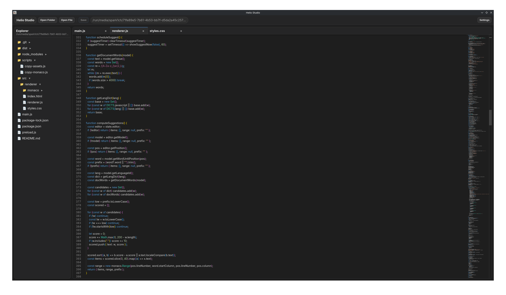

# Helio Studio

Helio Studio is a minimal and modern IDE designed to keep you focused and in flow.  
It is built with Electron and Monaco Editor and aims to feel lightweight, calm, and predictable, without visual noise or unnecessary complexity.

**Current version:** 1.0.5

---

## Overview

Helio Studio focuses on clarity and speed. Instead of overwhelming panels and endless configuration, it provides a small set of carefully chosen features that work together smoothly. The editor is optimized for keyboard-first interaction and fast startup, making it suitable for developers who prefer tools that stay out of the way.

---

## Features

Helio Studio uses the Monaco Editor, providing reliable syntax highlighting, autocomplete, and a familiar editing experience. Tabs have a fixed width with horizontal scrolling to keep the interface visually stable. When closing files with unsaved changes, a confirmation dialog helps prevent accidental data loss.

The application includes a built-in settings popup instead of separate windows. Both light and dark themes are available, along with adjustable code font size and tab width. Optional auto save can be enabled for a more seamless workflow. A simple project tree allows opening files and folders without clutter, and the Inter font is used consistently across the entire UI.

---

## Screenshot



---

## Settings

Settings can be accessed from the top bar. All configuration options are stored locally and restored automatically on the next launch.

You can change the theme, adjust the code font size, control tab width, and enable or disable auto save with a delay.

---

## Keyboard Shortcuts

Helio Studio is designed for efficient keyboard usage. Common actions like opening files or folders, saving, closing tabs, navigating between tabs, controlling font size, and triggering autocomplete are available through standard shortcuts on Windows, Linux, and macOS.

---

## Installation (Linux)

### AppImage

Download the latest AppImage from GitHub Releases, make it executable, and run it:

```bash
chmod +x Helio\ Studio-1.0.3.AppImage
./Helio\ Studio-1.0.3.AppImage
```
### Debian (.deb)

Download the Debian package and install it using `apt`:

```bash
sudo apt install ./helio-studio_1.0.5_amd64.deb
```
---

## Philosophy

Helio Studio is intentionally minimal. It avoids heavy panels, cluttered layouts, and unnecessary abstractions. The goal is to provide a predictable, fast, and calm development environment that supports focus rather than demanding attention.

---

## License

GPL-3.0

---

## Links

Version: 1.0.5  
Source code: https://github.com/the-spark1ch/helio-studio
