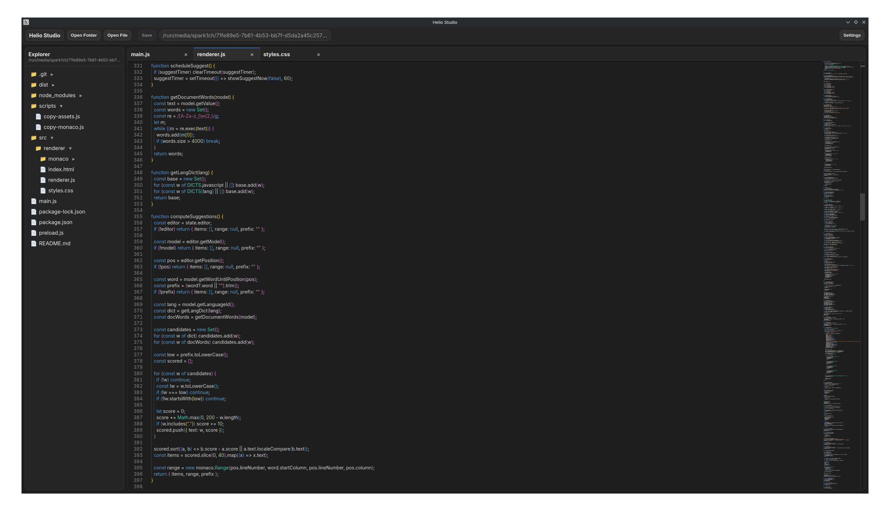

# Helio Studio

Helio Studio is a minimal and modern IDE designed to keep you focused and in flow. It is built with **Electron** and **Monaco Editor**, providing a fast and familiar editing experience while keeping the interface calm and predictable.

The goal of Helio Studio is simple: create a development environment that stays out of your way and lets you concentrate on writing code.

**Current version:** 1.0.9

---

## Overview

Helio Studio focuses on clarity, speed, and stability. Instead of overwhelming panels, complex layouts, and endless configuration options, it provides a carefully selected set of features that work together smoothly.

The editor is optimized for **fast startup**, **keyboard-first interaction**, and a visually stable interface. Everything is designed to reduce friction and avoid distractions, making the environment feel lightweight and consistent.

---

## Features

Helio Studio uses the Monaco Editor — the same editor engine that powers Visual Studio Code — offering reliable syntax highlighting, autocomplete, and a polished editing experience.

Key features include:

* Monaco-based code editor
* Fixed-width tabs with horizontal scrolling
* Protection when closing files with unsaved changes
* Built-in settings popup
* Light and dark themes
* Adjustable editor font size
* Adjustable tab width
* Optional auto-save with configurable delay
* Simple project file tree
* Recent files and folders
* Consistent interface using the Inter font

The interface is intentionally minimal so the editor remains focused on code rather than UI complexity.

---

## Screenshot



---

## Settings

Settings can be accessed directly from the top bar through the built-in settings dialog.

Available configuration options include:

* Theme (dark or light)
* Code font size
* Tab width
* Auto-save delay

All settings are stored locally and automatically restored on the next launch.

---

## Keyboard Shortcuts

Helio Studio is designed for efficient keyboard usage. Common actions such as opening files or folders, saving files, closing tabs, navigating between tabs, adjusting font size, and triggering autocomplete follow familiar shortcut conventions.

Shortcuts work consistently across **Linux, Windows, and macOS**.

---

## Installation

Helio Studio releases are available through GitHub.

### Windows

Download the latest version from GitHub Releases.

#### Installer (.exe)

1. Download **Helio Studio Setup.exe**
2. Run the installer
3. Follow the setup instructions
4. Launch Helio Studio from the Start Menu or desktop shortcut

#### Portable

If you prefer a portable version:

* Download **Helio Studio Portable.exe**
* Run it directly — no installation required

---

### Linux

#### AppImage

Download the latest AppImage from GitHub Releases, make it executable, and run it:

```bash
chmod +x Helio\ Studio-1.0.9.AppImage
./Helio\ Studio-1.0.9.AppImage
```

#### Debian (.deb)

Install the Debian package using `apt`:

```bash
sudo apt install ./helio-studio_1.0.9_amd64.deb
```

---

## Philosophy

Helio Studio is intentionally minimal.

It avoids heavy panels, cluttered layouts, and unnecessary abstractions. The aim is to provide a predictable and calm development environment that supports deep focus instead of competing for attention.

The editor should assist your workflow quietly in the background rather than becoming the center of it.

---

## License

GPL-3.0

---

## Links

Version: **1.0.9**

Source code:
https://github.com/the-spark1ch/helio-studio
